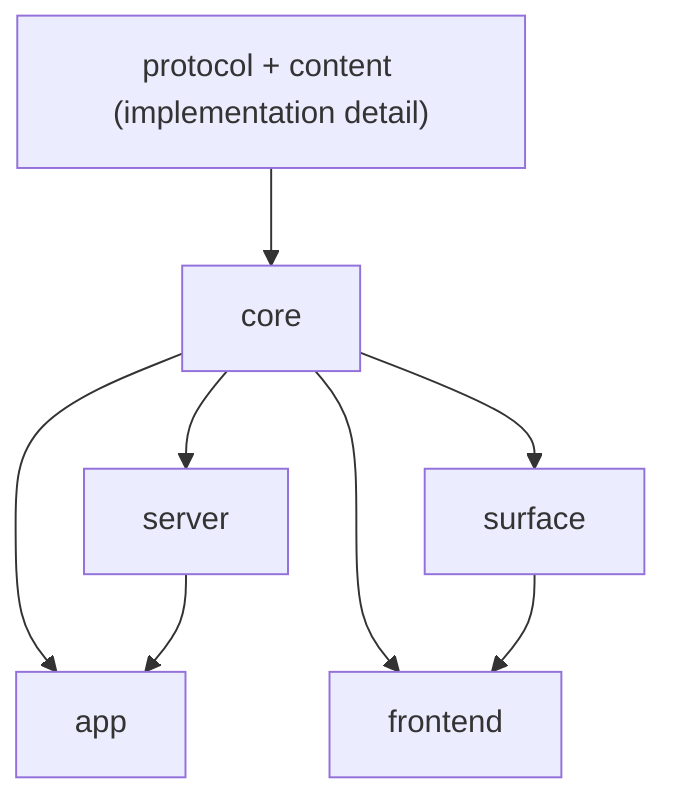

# Architecture

This page is the current architecture baseline for the MDAN SDK.

It answers three questions:

1. which layer owns which responsibility
2. how the source tree is organized
3. which dependency directions are allowed

If we keep these boundaries stable, we can continue slimming the SDK without
reintroducing server/frontend coupling.

## Top-Level Shape

The current package model is:

- `@mdanai/sdk`
  convenience root entry for app authoring and shipped frontend helpers
- `@mdanai/sdk/core`
  shared protocol, content, and pure surface semantics
- `@mdanai/sdk/app`
  app authoring
- `@mdanai/sdk/server`
  runtime and server orchestration
- `@mdanai/sdk/server/node`
  Node host adapter
- `@mdanai/sdk/server/bun`
  Bun host adapter
- `@mdanai/sdk/surface`
  headless browser runtime implementation
- `@mdanai/sdk/frontend`
  shipped frontend helpers and frontend-side contracts

The important split is:

- `core` owns pure semantics
- `server` owns runtime orchestration
- `surface` owns headless browser/runtime behavior
- `frontend` owns shipped UI and browser entry helpers

## Dependency Direction



Read this as:

- `core` is the shared semantic base
- `app` may depend on `core` and selected `server` contracts
- `server` depends on `core`
- `surface` depends on `core`
- `frontend` depends on `core` for pure semantics and on `surface` for runtime implementation

Two rules matter most:

- `server` must not depend on `frontend`
- `frontend` should not depend on `surface` implementation types when a frontend-local contract is enough

## Source Layout

### `src/core`

Current structure:

```text
src/core/
  content.ts
  protocol.ts
  index.ts
  surface/
    forms.ts
    markdown.ts
    presentation.ts
    readable.ts
    validation.ts
```

`core` owns:

- protocol types and manifest shapes
- markdown/executable-content parsing
- readable-surface normalization and validation
- pure surface presentation semantics
- pure form semantics

`core` must stay:

- pure
- environment-free
- runtime-free

That means no:

- `fetch`
- `window`
- `document`
- `FormData`
- `Headers`
- host adapters
- browser/server lifecycle logic

### `src/app`

Current structure:

```text
src/app/
  index.ts
```

`app` owns authoring:

- `createApp`
- field helpers
- app/page/action authoring shape
- authoring-friendly session helpers

`app` is intentionally higher-level than `server`.
It is the authoring layer, not the runtime layer.

### `src/server`

Current structure:

```text
src/server/
  index.ts
  runtime.ts
  response.ts
  result.ts
  result-normalization.ts
  router.ts
  handler-dispatch.ts
  session.ts
  action-proofing.ts
  request-inputs.ts
  ...
  host/
    adapter-shared.ts
    flow.ts
    shared.ts
    static-files.ts
  types/
    handler.ts
    result.ts
    session.ts
    transport.ts
    index.ts
```

`server` owns:

- runtime orchestration
- request/response flow
- action proof handling
- session runtime behavior
- Node/Bun host adapters

`server` should not own:

- shipped frontend rendering
- browser projection
- pure protocol/content semantics that can live in `core`

### `src/surface`

Current structure:

```text
src/surface/
  index.ts
  contracts.ts
  headless.ts
  snapshot.ts
  transport.ts
  adapter.ts
  content.ts
  forms.ts
```

`surface` is now a thin headless runtime layer.

It owns:

- `createHeadlessHost(...)`
- runtime state transitions
- browser-facing transport encoding
- snapshot state composition
- runtime contracts used by the headless host

It does **not** own pure semantics anymore.
Those have been pushed into `core/surface/*`.

### `src/frontend`

Current structure:

```text
src/frontend/
  index.ts
  contracts.ts
  entry.ts
  bootstrap.ts
  mount.ts
  model.ts
  snapshot.ts
  form-renderer.ts
  ui-form-renderer.ts
  register.ts
  theme.ts
  components/
    ...
```

`frontend` owns:

- shipped browser entry helpers
- shipped UI mount/render logic
- form renderer helpers
- frontend-local runtime contracts

`frontend/contracts.ts` exists so the frontend can type itself against a
minimal browser contract instead of directly depending on `surface`
implementation type names.

## What Belongs In `core`

Use this rule when deciding whether to move something into `core`.

It belongs in `core` if it is:

- a pure function
- a pure type layer
- a pure transformation
- shared by more than one upper layer
- independent of browser or server runtime environment

Good examples:

- readable-surface validation
- form defaulting rules
- action presentation semantics
- executable markdown/content parsing

## What Must Not Go Into `core`

It should stay out of `core` if it depends on:

- `fetch`
- `window`
- `document`
- `history`
- `FormData`
- `Headers`
- `File` runtime checks
- request/response lifecycle orchestration
- browser/server host behavior

Those belong in `server`, `surface`, or `frontend`.

This is the red line that keeps `core` from becoming a new monolith.

## Practical Ownership Rules

When in doubt:

- if it is about **meaning**, prefer `core`
- if it is about **running a request**, prefer `server`
- if it is about **running browser state**, prefer `surface`
- if it is about **rendering browser UI**, prefer `frontend`
- if it is about **authoring apps**, prefer `app`

## Current Public Surface

Recommended entry paths:

- convenience app + frontend authoring:
  `@mdanai/sdk`
- authoring:
  `@mdanai/sdk/app`
- app-facing hosting:
  `app.host("node" | "bun", options?)`
- hosting:
  `@mdanai/sdk/server/node` or `@mdanai/sdk/server/bun`
- runtime-only server work:
  `@mdanai/sdk/server`
- shared semantic layer:
  `@mdanai/sdk/core`
- custom browser runtime:
  `@mdanai/sdk/surface`
- shipped frontend:
  `@mdanai/sdk/frontend`

## Current Status

The large structural cleanup is mostly complete:

- `server -> frontend` coupling has been removed
- pure surface semantics have moved into `core`
- `surface` has been reduced to a thinner headless runtime
- `frontend` now owns its own minimal contracts

What remains is mostly boundary polish, not a fundamental restructuring pass.

## Related Docs

- [SDK Packages](/sdk-packages)
- [API Reference](/api-reference)
- [Browser Behavior](/browser-behavior)
- [Custom Rendering](/custom-rendering)
