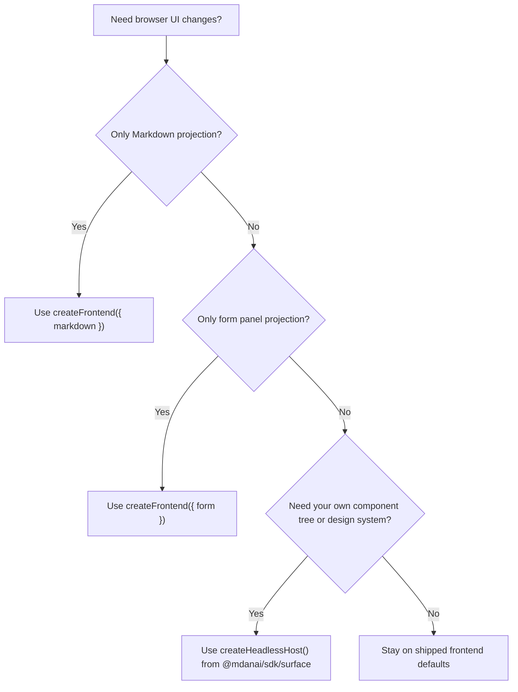

# Choose A Rendering Path

Use this page when you know you want browser UI customization, but you are not
yet sure which layer to change.

The shortest rule is:

- keep the shipped frontend if you only need projection changes
- move to custom rendering only when you want your own UI tree and component
  model

## Quick Decision Guide

## Path 1: Stay On The Shipped Frontend

Choose this path when:

- the default frontend already behaves the way you want
- you only need natural browser routes and the standard shipped UI
- you do not want to own browser rendering logic

Use:

- `createFrontend(...)`
- `frontend.boot(...)`
- `frontend.mount(...)`
- `frontend.render(...)`

This keeps both behavior and presentation on the shipped path.

## Path 2: Customize Markdown Projection

Choose this path when:

- the default action behavior is fine
- the default form UI is fine
- you only want Markdown blocks rendered differently

Use:

- `createFrontend({ markdown })`
- `frontend.mount(...)`
- `frontend.render(...)`

Read:

- [Markdown Rendering](/markdown-rendering)

## Path 3: Customize Form Projection

Choose this path when:

- Markdown projection is fine
- MDAN action behavior is fine
- you want different form markup, layout, or controls in the shipped frontend

Use:

- `createFrontend({ form })`
- `defineFormRenderer(...)`
- `frontend.mount(...)`
- `frontend.render(...)`

Read:

- [Form Rendering](/form-rendering)

## Path 4: Build A Fully Custom Frontend

Choose this path when:

- you want your own component tree
- you want your own design system or framework integration
- you do not want the shipped frontend structure at all

Use:

- `createHeadlessHost(...)` from `@mdanai/sdk/surface`

This path keeps MDAN behavior but replaces the shipped frontend presentation
layer entirely.

Read:

- [Custom Rendering](/custom-rendering)

## Practical Rule

Start at the smallest layer that solves the problem:

- projection only -> `createFrontend(...)` plus frontend renderers
- full UI ownership -> surface runtime

That keeps your integration simpler and keeps you closer to the shipped browser
behavior when you do not need a full rewrite.

## Related Docs

- [Markdown Rendering](/markdown-rendering)
- [Form Rendering](/form-rendering)
- [Custom Rendering](/custom-rendering)
- [Browser Behavior](/browser-behavior)
