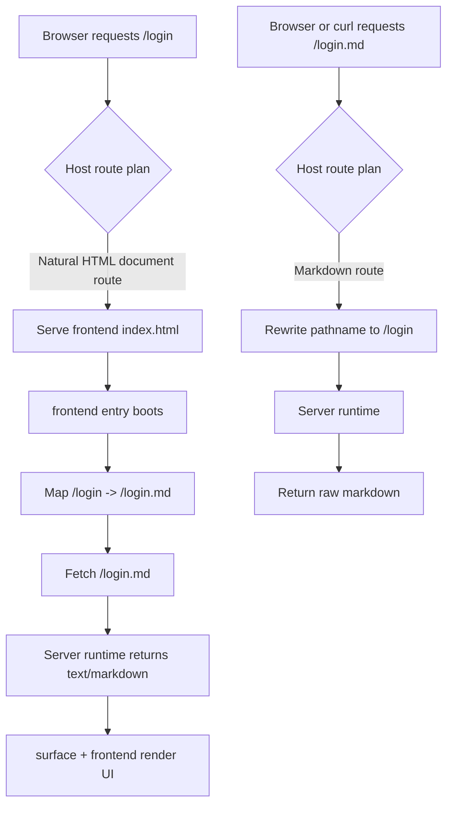
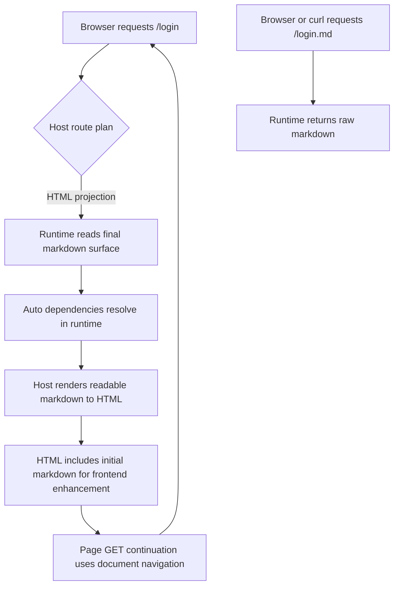

# Routing

This page explains the current MDAN routing model.

The short version is:

- browsers use natural routes such as `/login`
- raw MDAN content stays available on matching `.md` routes such as `/login.md`
- the current default browser mode keeps HTML projection in the frontend
- hosts can also opt into server-side readable HTML projection for browser
  document page flow

## The Two Route Forms

For each browser-facing route, there are two related forms:

- natural browser route
- raw markdown route

Examples:

- `/` -> `/index.md`
- `/login` -> `/login.md`
- `/quickstart` -> `/quickstart.md`

The natural route is what people open in the browser.

The `.md` route is the canonical raw MDAN response:

- `text/markdown`
- readable by humans, agents, and tooling
- still the source that the frontend consumes

## Request Flow

The default browser mode is client projection:



In HTML projection mode, browser document page flow stays on natural routes.
The host reads the same runtime surface, renders the readable markdown into the
HTML body, and gives the frontend enough initial markdown to enhance actions:



## Host Responsibilities

Host routing happens in:

- `src/server/host/shared.ts`

The host planner decides whether a request should:

- serve the frontend entry HTML
- serve a static file
- or continue into the markdown runtime

The important routing rules are:

- `GET` document requests without a file extension can serve the frontend entry
- `.md` requests always go to the markdown runtime
- `favicon` and static assets do not go through page routing
- `__mdan` asset routes stay reserved for frontend bundles and related assets

The Node and Bun adapters then execute that plan:

- `src/server/node.ts`
- `src/server/bun.ts`

## Frontend Entry Responsibilities

The frontend entry lives in:

- `src/frontend/entry.ts`

It does three things:

1. reads the current browser route
2. maps that route to the matching `.md` route when no initial markdown was
   provided by the host
3. boots the shipped frontend runtime against the initial or fetched markdown
   response

Examples:

- `/` becomes `/index.md`
- `/login` becomes `/login.md`

That means the browser-visible route stays clean while the underlying transport
still uses raw markdown.

## Why `.md` Matters

The `.md` route is not a compatibility hack. It is the canonical raw surface
route.

It matters because it gives us:

- a direct browser/debugging path to the raw markdown response
- a stable route for agents and tooling
- a clean way for the frontend entry to fetch MDAN content
- a routing model that does not require server-side HTML page rendering

## Browser Projection Modes

Client projection is the default:

```ts
app.host("bun", {
  frontend: true
});
```

Use HTML projection when browser page flow should remain server-projected HTML:

```ts
app.host("bun", {
  frontend: true,
  browser: {
    projection: "html"
  }
});
```

Both modes keep `/login.md` as the raw canonical markdown route. HTML
projection changes browser document page flow; action continuation that needs
region patching or POST behavior still uses the markdown surface protocol. In
HTML projection mode, the server owns readable Markdown rendering and the
frontend only mounts the action layer from the surface metadata. Protocol block
comments are not exposed as visible HTML; the browser DOM uses stable
`data-mdan-block` and `data-mdan-action-root` anchors instead.

## Practical Rules

- open `/login` in the browser when you want the app UI
- open `/login.md` when you want the raw markdown surface
- use client projection when the browser runtime should own page continuation
- use HTML projection for docs, public content, and SEO-sensitive routes

## Related Docs

- [Browser Behavior](/browser-behavior)
- [Architecture](/architecture)
- [Custom Rendering](/custom-rendering)
- [Choose A Rendering Path](/choose-a-rendering-path)
- [Server Adapters](/reference/server-adapters)
